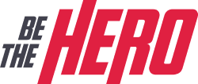

<h1 align="center">Welcome to Be The Heroo 👋</h1>



<p>
  
  <a href="#" target="_blank">
    
  </a>
</p>

> Platform to people discover and help NOG's (Non-governmental organizations).

## Install

```sh
npm install
```

## Run tests

```sh
npm run test
```

## Author

👤 **Eduardo Dias**

* Github: [@EduardoDias-M](https://github.com/EduardoDias-M)
* LinkedIn: [@Eduardo Dias](https://www.linkedin.com/in/eduardo-dias-680903152/)

## Show your support

Give a ⭐️ if this project helped you!
